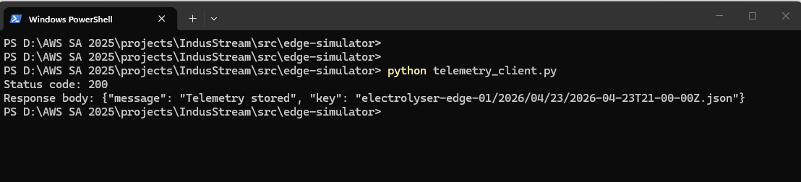
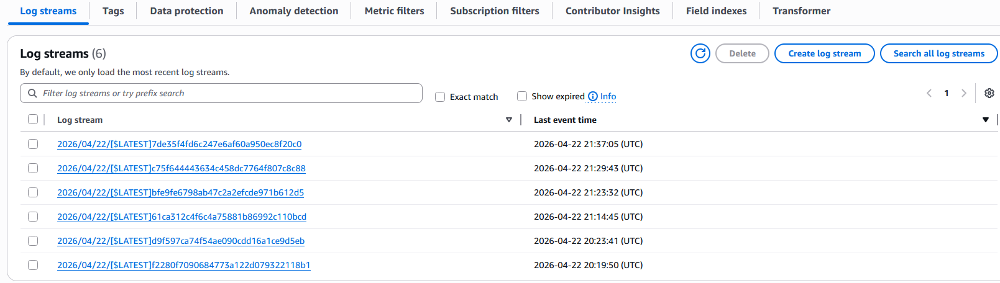

# v1 – Serverless Telemetry

Simulated telemetry data is sent to AWS and processed using a fully serverless architecture.

---

## Architecture

The system uses a serverless ingestion pattern:

* Amazon API Gateway – receives telemetry over HTTPS
* AWS Lambda – validates and processes data
* Amazon S3 – stores raw telemetry
* Amazon CloudWatch Logs – captures execution logs

---

## Architecture Diagram


---

## Data Flow

1. Edge simulator sends telemetry via HTTPS
2. API Gateway invokes Lambda
3. Lambda validates and stores data in S3
4. Lambda writes logs to CloudWatch

---

## Data Model

S3 object structure:

device_id/year/month/day/timestamp.json

Example:

electrolyser-edge-01/2026/04/18/2026-04-18T19-30-00Z.json

---

## Project Structure

```
docs/       architecture and design notes  
diagrams/   architecture diagram  
src/        application code  
infra/      infrastructure (future)  
```

---

### Successful API Call


### Stored Telemetry Data


### Observability (CloudWatch Logs)


## Future Work

* authentication and access control
* private networking (VPC)
* alerting and monitoring
* analytics (Athena / dashboards)

---

## Status

Version 1 focuses on a working telemetry ingestion pipeline with a clear, explainable architecture.
