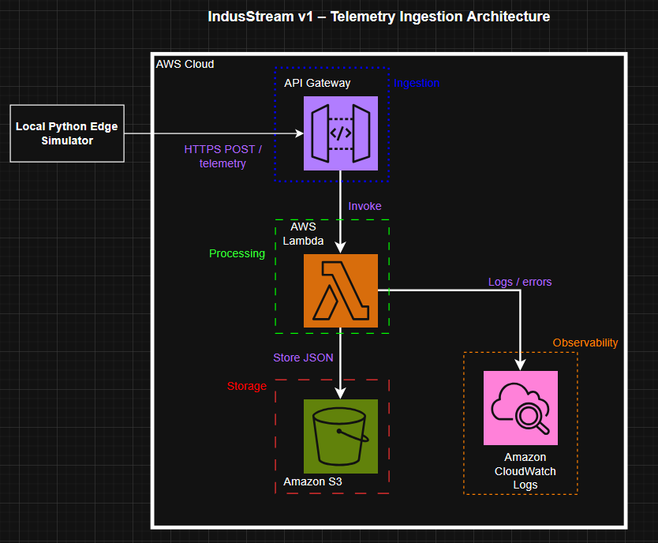
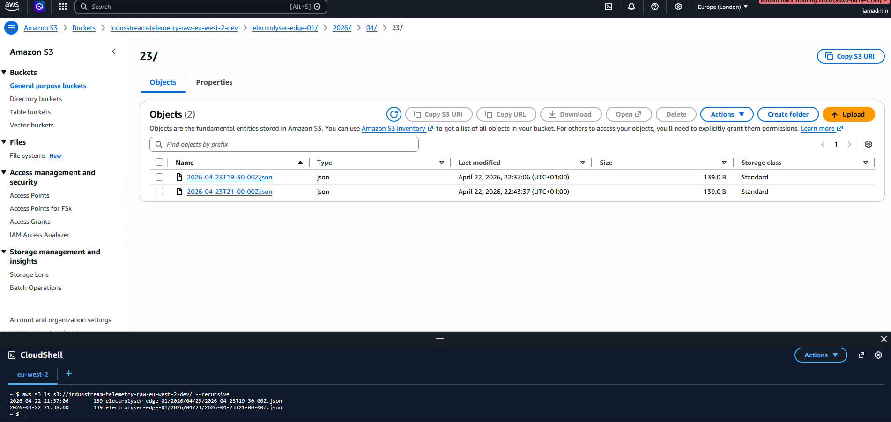

# v1 – Serverless Telemetry

Simulated telemetry data is sent to AWS and processed using a fully serverless architecture.

---

## Architecture

The system uses a serverless ingestion pattern:

* Amazon API Gateway – receives telemetry over HTTPS
* AWS Lambda – validates and processes data
* Amazon S3 – stores raw telemetry
* Amazon CloudWatch Logs – captures execution logs

---

## Architecture Diagram

---
## Design Decisions

Key architectural decisions and design considerations are documented in:

- [Project Scope](docs/adr/0001-project-scope.md)
- [Serverless Architecture](docs/adr/0002-serverless-architecture.md)
---
## Data Flow

1. Edge simulator sends telemetry via HTTPS
2. API Gateway invokes Lambda
3. Lambda validates and stores data in S3
4. Lambda writes logs to CloudWatch

---

## Data Model

S3 object structure:

device_id/year/month/day/timestamp.json

Example:

electrolyser-edge-01/2026/04/18/2026-04-18T19-30-00Z.json

---

### Successful API Call

### Stored Telemetry Data

### Observability (CloudWatch Logs)

## Key Learnings

- Building serverless data ingestion pipelines  
- Integrating API Gateway with Lambda  
- Designing S3 storage structures for telemetry  
- Using CloudWatch for observability  

---

## Future Improvements

- Authentication and access control  
- Private networking (VPC)  
- Alerting and monitoring  
- Query and analytics layer (Athena / dashboards)  

---

## Status

Version 1 demonstrates a working serverless telemetry ingestion pipeline with a clear and scalable architecture.
