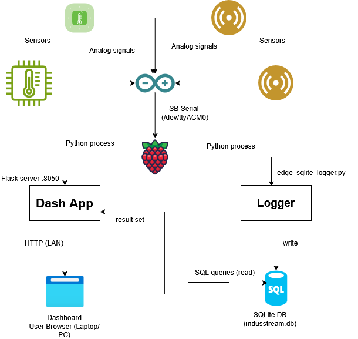
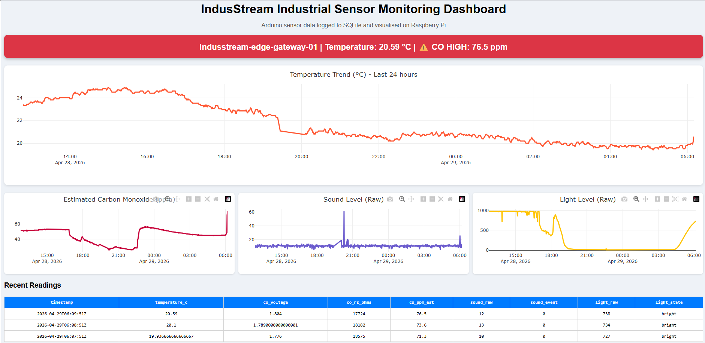

# IndusStream v2 – Edge Telemetry Dashboard

An edge-based telemetry system using Arduino and Raspberry Pi for real-time environmental monitoring and visualisation.

## Architecture



## Architecture Overview

This project implements an edge-based telemetry system using an Arduino and Raspberry Pi.

### Data Flow

1. Environmental sensor data is collected by an Arduino.
2. Data is transmitted via USB serial (`/dev/ttyACM0`) to a Raspberry Pi.
3. A Python-based logger (`edge_sqlite_logger.py`) reads and processes incoming data.
4. Processed data is stored locally in an SQLite database (`indusstream.db`).
5. A Dash web application serves a real-time dashboard via HTTP.
6. The dashboard is accessed remotely from a client browser on the local network.

### Design Principles

- Edge-first processing (no cloud dependency)
- Lightweight storage using SQLite
- Separation of data collection and visualisation
- Remote access via LAN (no GUI load on Raspberry Pi)

## Running the System

### Start Logger

```bash
cd 2-edge-dashboard
source venv/bin/activate
nohup python3 app.py > dashboard.out 2>&1 &
```

### Start Dashboard

```bash
cd dashboard
source venv/bin/activate
python3 app.py
```
Access dashboard at:
```bash
http://<raspberry-pi-ip>:8050
```

## Sample Data
Example telemetry data is included in: [data/sample_data.csv](data/sample_data.csv)

## Dashboard Preview

The dashboard displays real-time environmental sensor data collected at the edge and stored locally on the Raspberry Pi. It includes basic alerting for carbon monoxide (CO) levels. 
> Note: Sensor readings are indicative and require proper calibration for accurate measurements.

