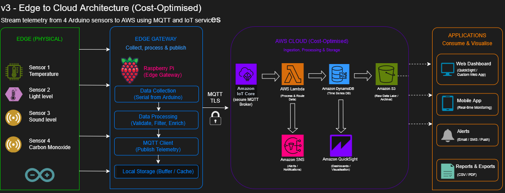

# v3 – Edge to Cloud

This version extends the system from local edge processing to cloud-based telemetry ingestion using AWS IoT services.

Sensor data is collected via Arduino devices, processed by a Raspberry Pi edge gateway, and streamed to AWS using Message Queuing Telemetry Transport (MQTT).

---

## Architecture

---

## Overview

* Edge devices (Arduino sensors) generate telemetry data
* Raspberry Pi acts as the edge gateway (collection + processing)
* Data is published to AWS IoT Core via MQTT
* AWS services process and store the data for further use

---

## Status

In progress
