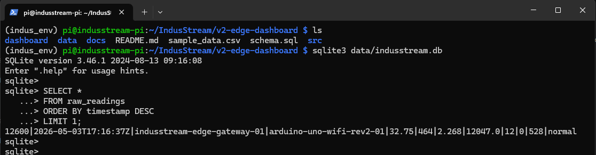
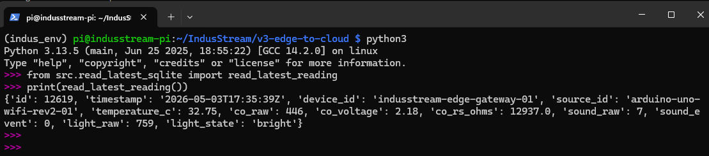

# 01 – Edge Ingestion: Sensors to Raspberry Pi

This stage covers how sensor data is collected at the edge and stored locally before being published to AWS.

## Flow

```text
    Sensors --> Arduino --> Raspberry Pi --> SQLite
```
## Overview

The Arduino collects readings from the connected sensors and sends the data to the Raspberry Pi. The Raspberry Pi acts as the edge gateway and stores the incoming readings in a local SQLite database.

SQLite is used as a lightweight local buffer so that sensor data can still be retained even if cloud connectivity is unavailable.

## Components
* Arduino – reads sensor values
* Sensors – temperature, carbon monoxide, sound, and light
* Raspberry Pi – receives and processes sensor readings
* SQLite – stores readings locally before cloud publishing

## Local Buffering

Using SQLite at the edge provides:

* temporary storage before cloud upload
* resilience during network interruptions
* a local source for the dashboard
* a stable input source for the MQTT publisher

## Validation

Sensor data can be validated directly on the Raspberry Pi using SQLite. This confirms that data is being collected and stored locally before any cloud processing occurs.

### 1. Connect to Raspberry Pi

Connect via SSH (the querry will be performed remoetly via SSH from another machine - Windows Power Shell):

```bash
ssh pi@<raspberry-pi-ip>
```
Navigate to the project directory:
```bash
cd ~/IndusStream/v2-edge-dashboard
```
### 2. Query the SQLite Database

Open the database:
```bash
sqlite3 data/indusstream.db
```
Run the following query to retrieve the latest sensor reading:
```SQL
SELECT *
FROM raw_readings
ORDER BY timestamp DESC
LIMIT 1;
```
Sample query output: via SQLite Querry




### 3. Validation via Python Reader

The same data can be accessed using the Python reader module:

```Python
from src.read_latest_sqlite import read_latest_reading
print(read_latest_reading())
```


