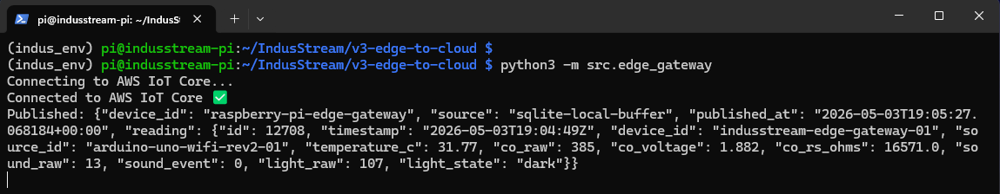
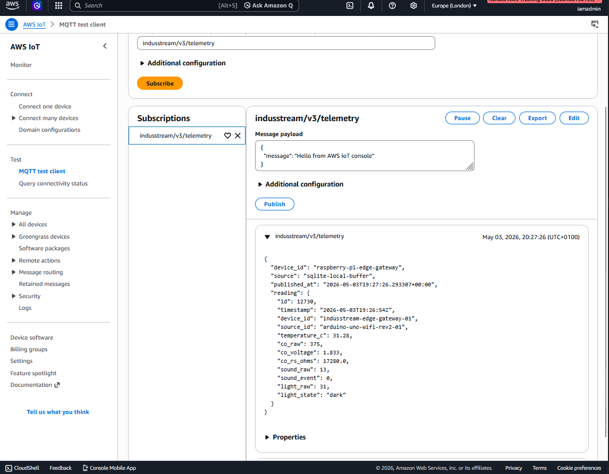

# 02 – MQTT Publishing: Edge to AWS IoT Core

This stage covers how telemetry data is transmitted from the Raspberry Pi edge gateway to AWS IoT Core using MQTT (Message Queuing Telemetry Transport).

---

## Flow

```text
SQLite --> Edge Gateway --> MQTT --> AWS IoT Core
```
## Overview

The Raspberry Pi acts as the edge gateway. It reads the latest sensor data from the local SQLite database and publishes it to AWS IoT Core using MQTT.

MQTT is a lightweight publish/subscribe messaging protocol designed for IoT systems with constrained devices and unreliable networks, making it well-suited for edge-to-cloud communication.

## MQTT Topic

Sensor data is published to the following topic:
```Bash
indusstream/v3/telemetry
```

This topic serves as the ingestion point for downstream cloud processing.

# Payload Structure

Example payload sent to AWS IoT Core:

```JSON
{
  "device_id": "raspberry-pi-edge-gateway",
  "source": "sqlite-local-buffer",
  "published_at": "2026-05-02T17:56:16Z",
  "reading": {
    "timestamp": "2026-05-02T17:55:51Z",
    "temperature_c": 29.33,
    "co_raw": 366,
    "co_voltage": 1.789,
    "co_rs_ohms": 17951.0,
    "sound_raw": 11,
    "sound_event": 0,
    "light_raw": 9,
    "light_state": "dark"
  }
}
```
## Key Components

The MQTT publishing functionality is implemented using the following Python modules:

### External Libraries
* paho.mqtt.client – MQTT client for connecting and publishing to AWS IoT Core
* ssl – enables secure TLS communication
* json – serializes payload data
* time – controls publishing intervals

### Internal Modules
* src.read_latest_sqlite – retrieves latest sensor reading from SQLite
* src.config.settings – stores AWS endpoint, topic, and certificate paths

## Security (TLS)

Communication with AWS IoT Core is secured using TLS certificates:

* Root CA certificate
* Device certificate
* Private key

These ensure encrypted and authenticated communication between the edge device and AWS (These are never be committed to version control.)

## Implementation

Run the edge gateway:
```Bash
python3 -m src.edge_gateway
```

The gateway performs  the following:

* Reads latest sensor data from SQLite
* Formats the payload as JSON
* Establishes a secure MQTT connection
* Publishes to AWS IoT Core topic
* Repeats at a configured interval

## Validation

### a. Start the Edge Gateway (for continous publishing)

```Bash
python3 -m src.edge_gateway
```
This starts the edge gateway, which continuously reads the latest sensor data from SQLite and publishes it to AWS IoT Core.

Example terminal output:



## b. Verify Messages in AWS IoT Core
* Open AWS IoT Core
* Navigate to MQTT Test Client
* Subscribe to: 
```Bash 
indusstream/v3/telemetry
```

You should observe live incoming telemetry messages.

Example:


