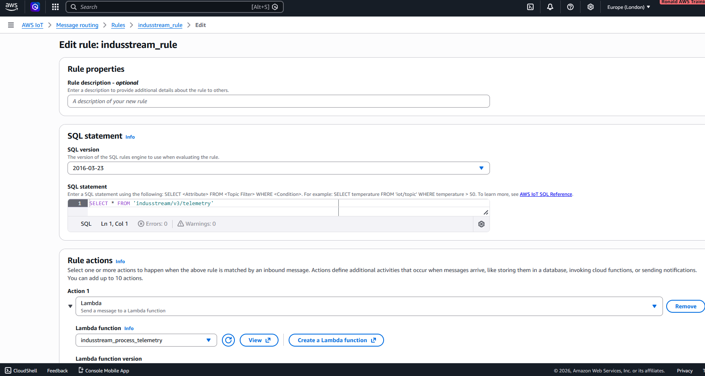
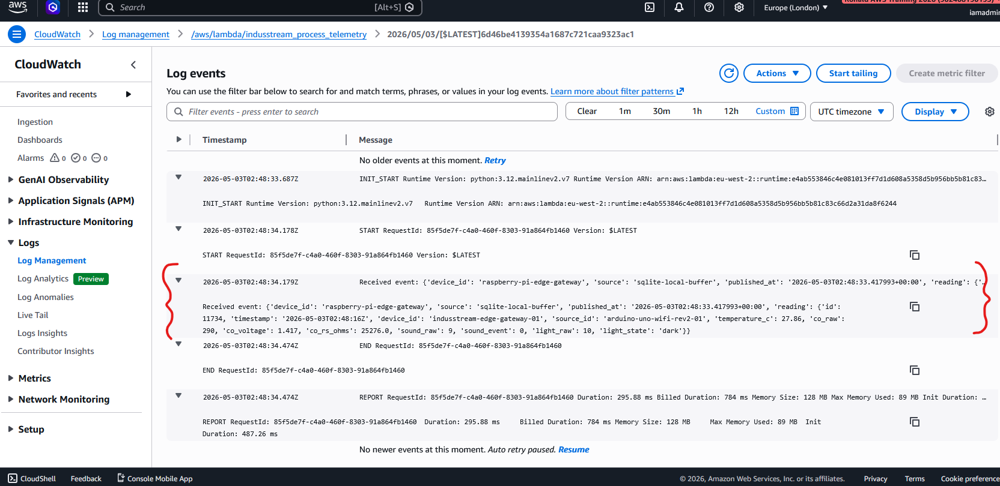

# 03 – Lambda Processing: IoT Core to DynamoDB

This stage covers how telemetry messages received by AWS IoT Core are processed by AWS Lambda and written to DynamoDB.

---

## Flow

```text
AWS IoT Core --> IoT Rule --> AWS Lambda --> DynamoDB
```
## Overview

AWS IoT Core receives MQTT telemetry messages from the Raspberry Pi edge gateway. An IoT Rule listens to the telemetry topic and invokes a Lambda function.

The Lambda function transforms each incoming MQTT payload into a structured telemetry record before storing it in DynamoDB. This transformation is designed to support scalability as more edge devices are added, while also keeping the data clean and consistent for future analytics and dashboarding.

The transformed structure separates device identity, timestamps, metrics, status values, and metadata. This design avoids flat, ad-hoc records and provides a consistent schema that can scale across multiple telemetry devices and sensor types.

## IoT Rule

The IoT Rule subscribes to the MQTT telemetry topic:

```SQL
SELECT * FROM 'indusstream/v3/telemetry'
```
The rule action invokes the Lambda function responsible for processing telemetry data.

Example:


## Lambda processing logic

The Lambda function receives the MQTT payload from AWS IoT Core and transforms it into a structured DynamoDB item.

The key steps are:

- **Receive incoming event**

```Python
print("Received event:", event)
reading = event.get("reading", {})
```
- **Extract timestamp**

```Python
timestamp = reading.get("timestamp") or datetime.now(timezone.utc).isoformat()
```
- **Build structured DynamoDB item**

The function creates an item containing device identity, timestamp, metadata, metrics, status, and TTL.

```Python
item = {
    "device_id": event.get("device_id") or reading.get("device_id", "unknown-device"),
    "timestamp": timestamp,
    "schema_version": "v1",
    "source_id": reading.get("source_id", "unknown-source"),
    "source": event.get("source", "sqlite-local-buffer"),
    "ingested_at": datetime.now(timezone.utc).isoformat(),
}
```
- **Convert numeric sensor values safely**

```Python
def clean_number(value):
    if value is None:
        return None

    if isinstance(value, dict) and "N" in value:
        return Decimal(value["N"])

    return Decimal(str(value))
```

This ensures numeric telemetry values are stored correctly in DynamoDB.

- **Group sensor values under metrics**

```Python
"metrics": {
    "co_voltage": clean_number(reading.get("co_voltage")),
    "temperature_c": clean_number(reading.get("temperature_c")),
    "light_raw": clean_number(reading.get("light_raw")),
    "sound_raw": clean_number(reading.get("sound_raw")),
    "co_raw": clean_number(reading.get("co_raw")),
    "co_rs_ohms": clean_number(reading.get("co_rs_ohms")),
}
```
- **Group interpreted values under status**

```Python

"status": {
    "light_state": reading.get("light_state"),
    "sound_event": bool(reading.get("sound_event", 0)),
}
```
- **Adds TTL (time-to-live) for automatic data expiry**

```Python

"ttl": int(time.time()) + (TTL_DAYS * 24 * 60 * 60)
```
With TTL_DAYS = 30, records are marked for expiry after 30 days.

- **Write item to DynamoDB**
```Python
table.put_item(Item=item)
```
Example Lambda console / logs:



The highlighted section (in red brackets) shows the Lambda function successfully receiving and processing a telemetry event from AWS IoT Core. The `Received event` log entry confirms that the MQTT message payload has been passed into the Lambda function and parsed correctly. This includes device metadata (e.g. `device_id`, `source`) and the nested `reading` object containing sensor values such as `temperature_c`, `co_raw`, and `light_state`. This log output validates that the IoT Rule trigger is functioning as expected and that real telemetry data is flowing into the serverless processing layer.

This step is critical, as it verifies the integrity of the ingestion pipeline before data transformation and storage in DynamoDB.

## IAM Role and Permissions

The Lambda execution role requires permission to write items to DynamoDB.

Minimum required permission:

```json
{
  "Effect": "Allow",
  "Action": "dynamodb:PutItem",
  "Resource": "arn:aws:dynamodb:<region>:<account-id>:table/indusstream_telemetry"
}

Target table:
```text
indusstream_telemetry
```
For development, broader permissions may be used temporarily, but production deployments should use least-privilege IAM policies.

### Data Transformation

Incoming MQTT payloads are transformed into a structured DynamoDB item within the Lambda function.

The transformation:

* extracts the reading object from the incoming event
* adds metadata (schema_version, source, ingested_at)
* groups raw sensor values under metrics
* groups interpreted values under status
* assigns a ttl value for lifecycle management

Example processed item:
```JSON
{
  "device_id": "raspberry-pi-edge-gateway",
  "timestamp": "2026-05-02T21:20:22Z",
  "schema_version": "v1",
  "source": "sqlite-local-buffer",
  "source_id": "arduino-uno-wifi-rev2-01",
  "ingested_at": "2026-05-02T21:20:25Z",
  "metrics": {
    "temperature_c": 29.33,
    "co_raw": 450,
    "co_voltage": 2.199,
    "co_rs_ohms": 12733,
    "light_raw": 36,
    "sound_raw": 13
  },
  "status": {
    "light_state": "dark",
    "sound_event": false
  },
  "ttl": 1780348226
}
```
This structure ensures scalability across multiple devices and supports efficient querying and downstream analytics.

## TTL (Time-To-Live)

DynamoDB TTL is used to automatically expire old telemetry records.

TTL attribute:
```text
ttl
```
The value is stored as a Unix epoch timestamp (in seconds):
```text
ttl = int(time.time()) + (TTL_DAYS * 24 * 60 * 60)
```
With TTL_DAYS = 30, records are marked for deletion after 30 days.

This helps control storage costs and ensures the table only contains relevant recent telemetry.

## Validation
### 1. Confirm IoT Rule Trigger

Verify that the IoT Rule is enabled and connected to the correct MQTT topic.
indusstream/v3/telemetry

### 2. Confirm Lambda Execution

Check Lambda logs in CloudWatch to confirm that telemetry events are being received and processed.
Lambda Logs

### 3. Confirm DynamoDB Write

Open DynamoDB and confirm that new structured telemetry items are being written to the table.

