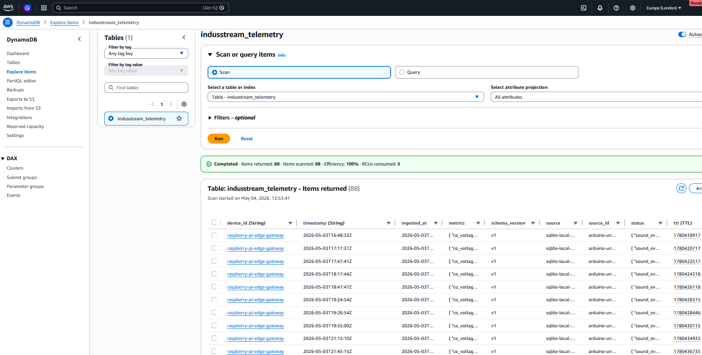

# 04 – Data Storage: DynamoDB Design and Future S3 Integration (WIP)

This stage defines how processed telemetry data is stored in DynamoDB and outlines the evolution toward long-term storage and analytics using Amazon S3 and QuickSight.

DynamoDB is used as the operational data store for real-time telemetry processing, enabling low-latency queries, alerting, and time-based access patterns. 

To support long-term analytics and cost-efficient storage, a parallel data pipeline writes flattened telemetry records to Amazon S3, which serves as the data lake for Athena and QuickSight.

This separation of concerns allows the system to handle both real-time processing and large-scale analytics efficiently.
---

## Table Design

The DynamoDB table is designed using a composite primary key:

```Bash
Partition Key (PK): device_id  
Sort Key (SK): timestamp
```

## Why this design?

* device_id (PK) : Groups all readings from the same device together

* timestamp (SK) : Enables efficient time-based queries (e.g. latest readings, time ranges)

## This structure allows queries such as:

* “Get latest reading for a device”
* “Get all readings between two timestamps”
* “Retrieve full telemetry history for a device”

## Item Structure

Each record stored in DynamoDB follows a consistent schema:

```JSON
{
  "device_id": "raspberry-pi-edge-gateway",
  "timestamp": "2026-05-02T21:20:22Z",
  "schema_version": "v1",
  "source": "sqlite-local-buffer",
  "source_id": "arduino-uno-wifi-rev2-01",
  "ingested_at": "2026-05-02T21:20:25Z",
  "metrics": {
    "temperature_c": 29.33,
    "co_raw": 450,
    "co_voltage": 2.199,
    "co_rs_ohms": 12733,
    "light_raw": 36,
    "sound_raw": 13
  },
  "status": {
    "light_state": "dark",
    "sound_event": false
  },
  "ttl": 1780348226
}
```
