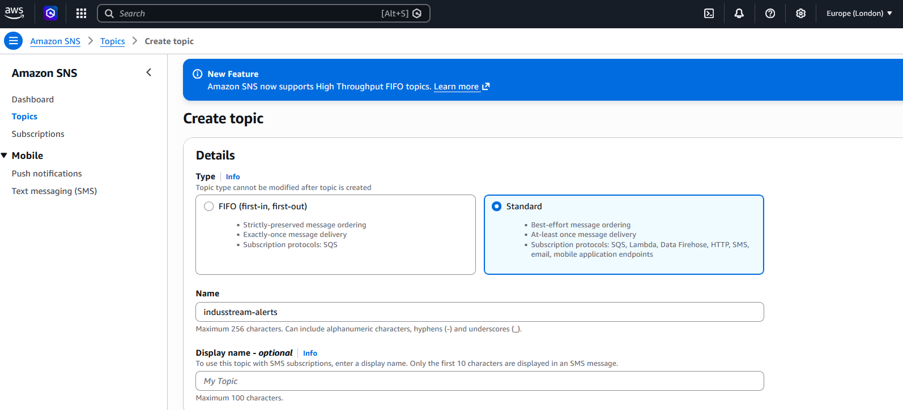
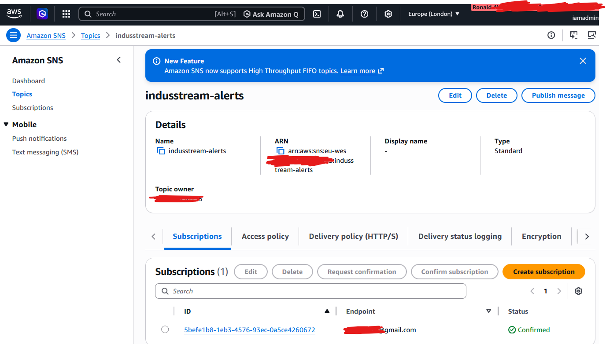
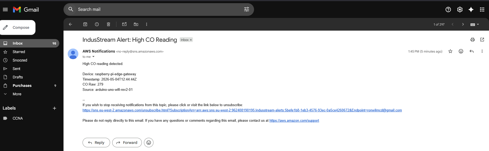

# 05 – Notifications and Analytics

This stage extends the system beyond real-time ingestion and storage by introducing alerting, long-term data retention, and analytics capabilities.

While DynamoDB serves as the operational data store for low-latency access to recent telemetry, additional services are integrated to support downstream use cases including alerting, historical analysis, and dashboarding.

---

## Architecture Extension

To support these capabilities, the architecture is extended with additional AWS services:

* Amazon SNS enables real-time notifications based on telemetry conditions  
* Amazon S3 provides scalable and cost-effective long-term storage  
* Amazon QuickSight enables visualisation and dashboarding  

Together, these components transform the system from a data pipeline into a complete, production-ready analytics architecture.

---

## 5.1 Amazon SNS (Alerts)

Amazon SNS is used to send notifications when telemetry values meet defined alert conditions.

In this project, SNS is used to detect abnormal sensor readings, such as elevated carbon monoxide levels, and trigger notifications without requiring manual monitoring.

---

### Alert Flow

```text
Telemetry Payload → Lambda → Condition Check → Amazon SNS → Email / SMS
```

### Trigger Conditions

Alert conditions are evaluated within the Lambda function based on incoming telemetry values.

Typical conditions include:

* High carbon monoxide readings
* Abnormal sensor readings
* Missing or irregular telemetry datas

Example condition:

```Python

if co_raw >= CO_RAW_ALERT_THRESHOLD:
    publish_alert()
```

### Publishing Alerts from Lambda

The Lambda function evaluates telemetry values and publishes an alert to Amazon SNS when a threshold condition is met.

Example implementation:

```python
co_raw = item["metrics"].get("co_raw")

if co_raw is not None and co_raw >= CO_RAW_ALERT_THRESHOLD:
    sns.publish(
        TopicArn=SNS_TOPIC_ARN,
        Subject="IndusStream Alert: High CO Reading",
        Message=(
            f"High CO reading detected.\n\n"
            f"Device: {item['device_id']}\n"
            f"Timestamp: {item['timestamp']}\n"
            f"CO Raw: {co_raw}"
        )
    )
```
This ensures that alerts are triggered automatically based on real telemetry conditions.

> The SNS topic ARN is configured using a Lambda environment variable.

### Notifications Channels

Amazon SNS supports multiple delivery mechanisms:

* Email
* SMS
* Other subscribed endpoints

For this project, email notifications will be used because they are simple and cost-effective.

### NS Workflow Validation

The following screenshots demonstrate the complete SNS alerting workflow:

#### SNS Topic Configuration



#### Subscription Confirmation



#### Alert Notification



These confirm that telemetry-driven alerts are successfully generated, processed by Lambda, and delivered via SNS in near real time.