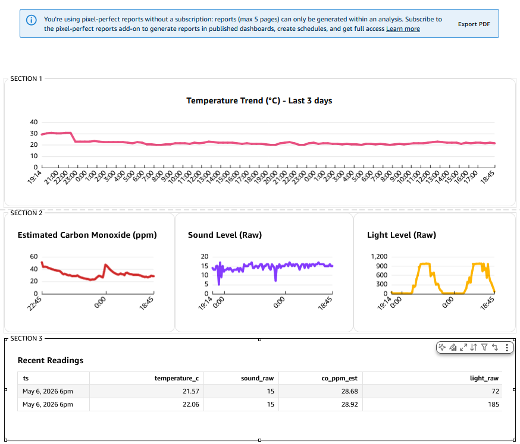

### 7 Amazon QuickSight (Dashboarding)

Amazon QuickSight is used to visualise telemetry data stored in Amazon S3 and queried through Athena.

The QuickSight dashboard uses SPICE for improved performance and scheduled refresh, providing near-real-time analytics while reducing query overhead on Athena.

---

### Dashboard Capabilities

The dashboard provides near-real-time insights into sensor readings, including:

* Temperature trends  
* Carbon monoxide (CO) levels  
* Sound intensity  
* Light levels  

Key features include:

* Time-series visualisations for sensor metrics  
* A recent readings table displaying the latest telemetry values  
* Aggregated views to identify trends and anomalies  

---

### Data Integration

QuickSight queries data via Athena, which reads structured JSON data stored in Amazon S3. This enables scalable and cost-effective analytics over large datasets without impacting the operational DynamoDB workload.

---

### Data Freshness

Due to the architecture (S3 → Athena → QuickSight), the dashboard operates in near-real-time rather than real-time.

Data freshness depends on:

* S3 data ingestion timing  
* Athena query execution  
* SPICE dataset refresh schedules  

---

### Dashboard Overview

The dashboard demonstrates how telemetry data flows from edge devices into a cloud-native analytics stack, enabling monitoring, alerting, and historical analysis.

